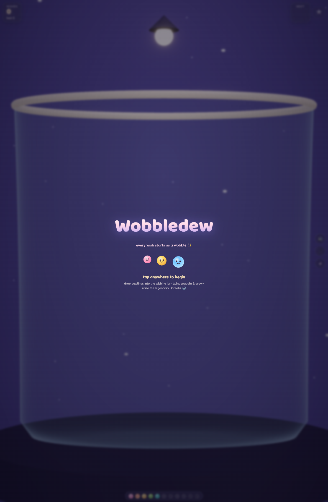
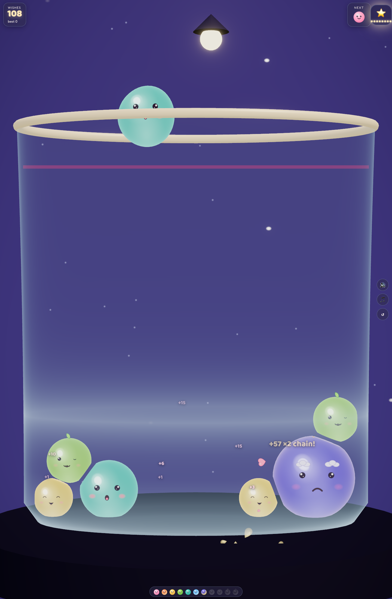
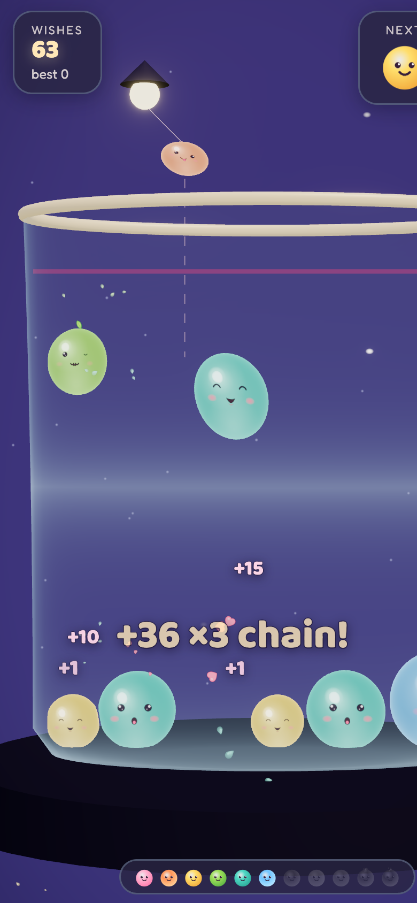

# 🫧 Wobbledew

*Every wish starts as a wobble.*

A squishy, jelly-physics merge puzzle (Suika-like) for the web. Drop **Dewlings** — living jelly
spirits born from falling sky-dew — into a lighthouse keeper's glass wishing jar. Twins snuggle and
merge up an 11-character chain, from Plip the snoring newborn all the way to **Borealis**, the
legendary aurora sky-whale. Losing isn't failure: it's *bedtime*. 🌙

| Title | Gameplay | Mobile |
|:--:|:--:|:--:|
|  |  |  |

## Play

- **Aim** with mouse/touch (or ←/→), **release/tap/space** to drop
- Two of the same Dewling **merge** into the next — chains rise in pitch and compose a melody
- Twins near each other **snuggle** (they blush, lean, and pull together)
- Every 8 merges the lamp banks a **⭐ Star Snack** — drop it on a buried Dewling to grow it in place
- Keep the pile under the pink line, or it's bedtime

## Run it

```bash
npm install
npm run gen:assets   # synthesize the .wav audio assets (committed, so optional)
npm run dev          # play at the printed URL
npm run build        # static production build → dist/
```

## How it's made

- **Vite + TypeScript + Three.js**, pmndrs `postprocessing` (bloom/vignette/ACES)
- **Custom 2D verlet physics** (canon Suika feel: equal mass, merge on first contact, triangular
  scoring) driving 3D jelly meshes — all soft-body deformation happens in a **custom GLSL vertex
  shader** fed by real per-frame contact data (squash, stretch, wobble, contact flattening)
- **Faces are physics readouts**: eyes squint under real compression, pupils track the held blob,
  blinks, moods, worry near the lose line
- **Every asset is generated**: all SFX + the seamless music-box loop are synthesized to real `.wav`
  files by a zero-dependency Node script (`tools/gen-audio.mjs`); art is hand-authored SVG +
  runtime-generated canvas textures (matcap, eye atlas)
- `?demo=1` runs a deterministic autoplay used for headless-Chrome screenshot verification

Design + implementation notes live in [`plans/`](plans/) and [`CLAUDE.md`](CLAUDE.md).

---

🤖 Built with [Claude Code](https://claude.com/claude-code)
